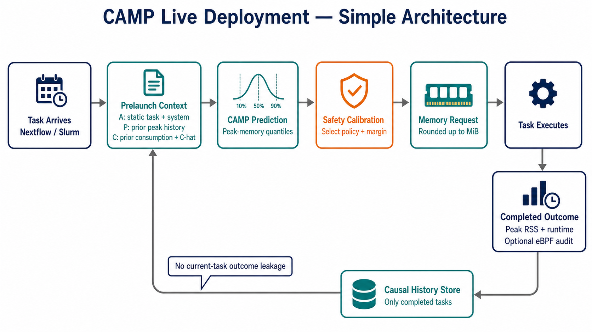
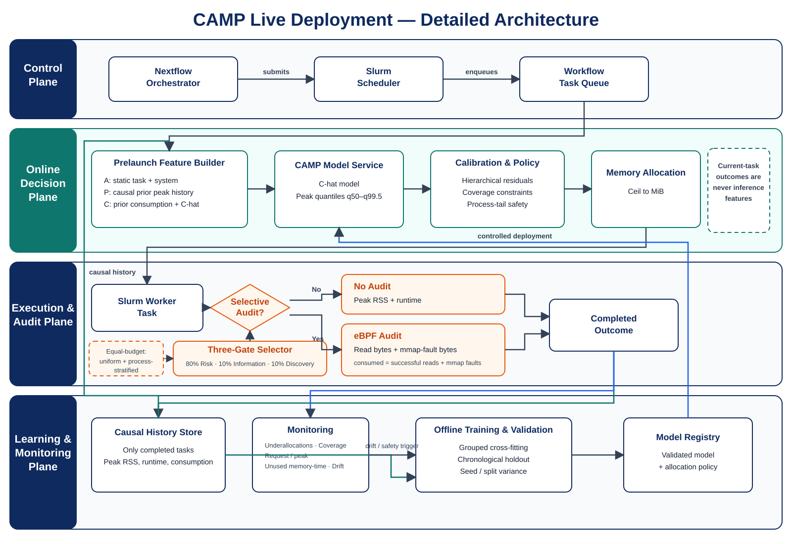

# CAMP live-deployment architecture diagrams

## Simple architecture

The simple view shows the latency-sensitive online path and the causal
completed-task feedback loop.

## Detailed architecture

The detailed view separates scheduler control, online inference, task
execution and selective auditing, and offline learning and monitoring. It
shows how validated models and policies return to the live model service while
current-task outcomes remain outside inference features.

